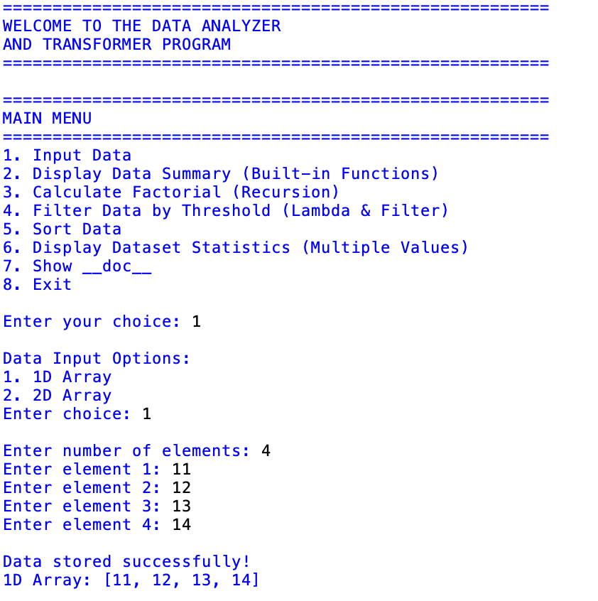
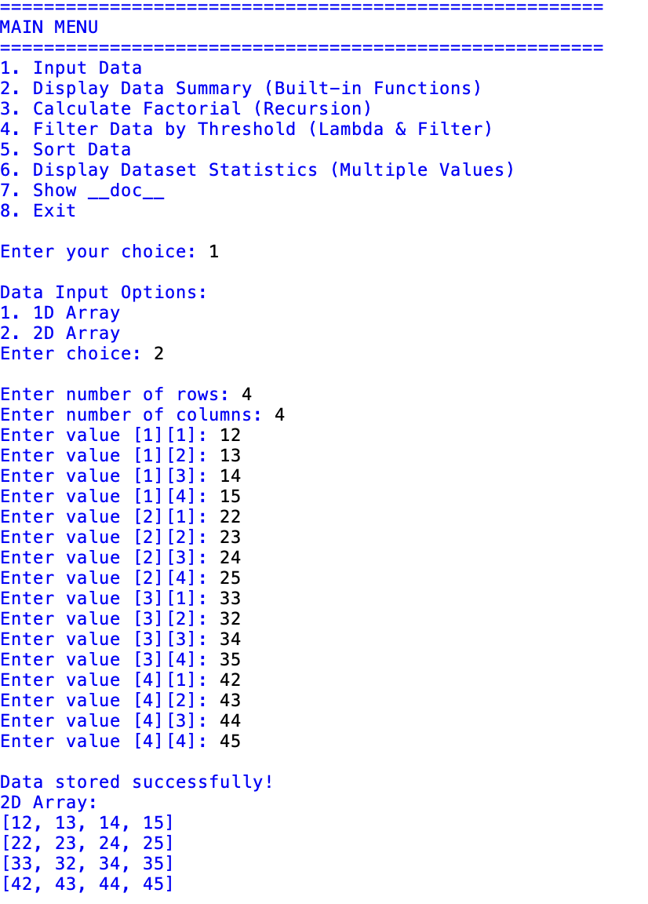
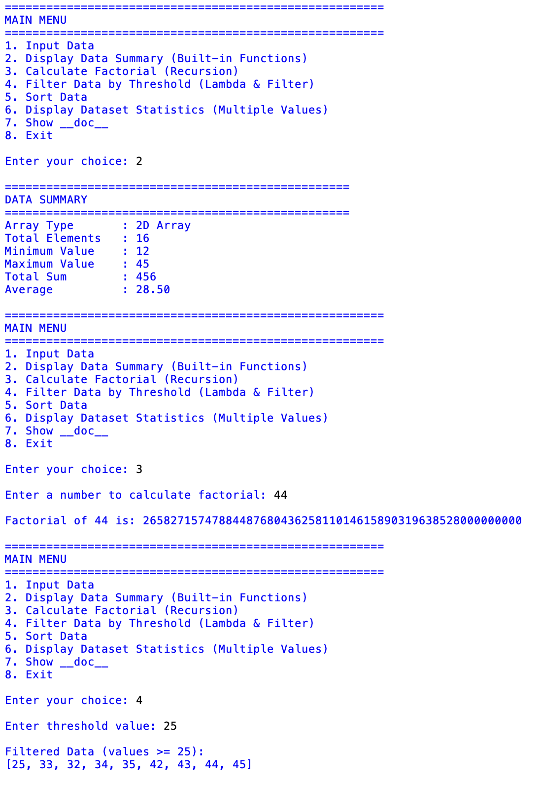
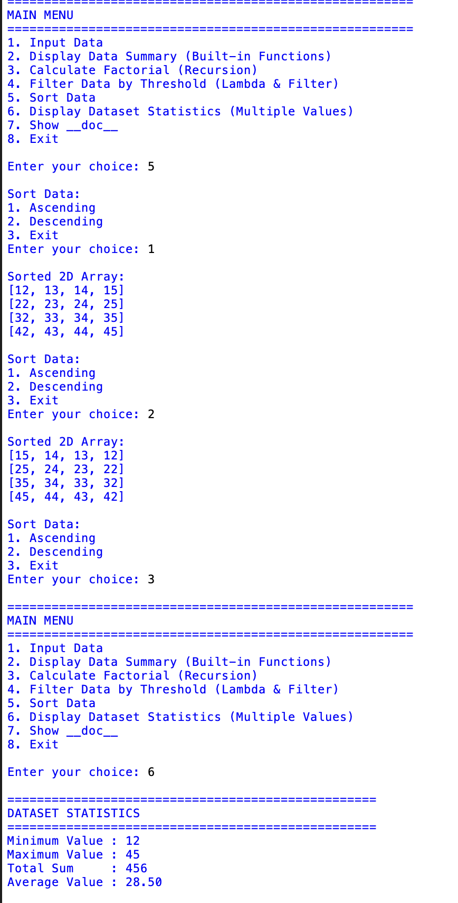
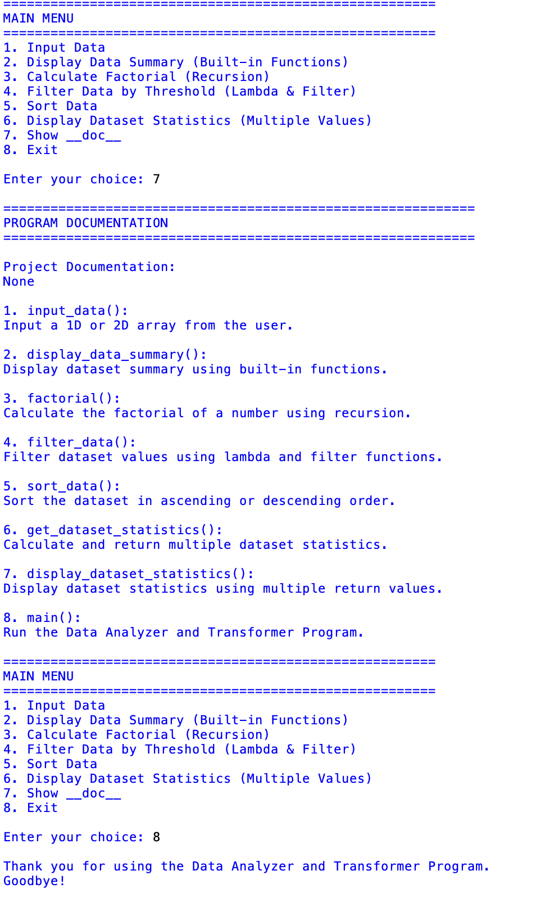

# ⚡ Data Analyzer & Transformer

<div align="center">

### 🐍 A Menu-Driven Python Data Processing Project

**Analyze • Transform • Filter • Sort • Calculate**

<br>


</div>

---

## ✨ Overview

**Data Analyzer & Transformer** is a Python console application that demonstrates important Python programming concepts through an interactive menu-driven program.

The program allows users to enter **1D or 2D integer arrays** and perform operations such as data analysis, factorial calculation, filtering, sorting, statistics calculation, and documentation display.

---

## 🎯 Project Features

```text
📥  Input 1D / 2D Data
📊  Display Data Summary
🔢  Calculate Factorial using Recursion
🔎  Filter Data using Lambda & Filter
↕️   Sort Data
📈  Display Dataset Statistics
📚  Display Documentation using __doc__
🚪  Exit Program
```

---

## 🧩 Program Workflow

```text
                     ┌───────────────┐
                     │     START     │
                     └───────┬───────┘
                             │
                             ▼
                     ┌───────────────┐
                     │   MAIN MENU   │
                     └───────┬───────┘
                             │
          ┌──────────────────┼──────────────────┐
          │                  │                  │
          ▼                  ▼                  ▼
     📥 Input Data      📊 Analyze Data    🔄 Transform
          │                  │                  │
          ▼                  ▼                  ▼
       1D / 2D          Summary          Filter / Sort
                             │
                             ▼
                       📈 Statistics
                             │
                             ▼
                      📚 Documentation
                             │
                             ▼
                          🚪 EXIT
```

---

# 🚀 Features

### 📥 Data Input

The program supports:

- 1D Array
- 2D Array

Users can enter the required number of elements, rows, and columns.

---

### 📊 Data Summary

Displays:

- Array type
- Total elements
- Minimum value
- Maximum value
- Total sum
- Average

Uses Python built-in functions:

```python
len()
min()
max()
sum()
```

---

### 🔢 Factorial

Calculates the factorial of a number using **recursion**.

Example:

```text
Enter a number to calculate factorial: 5

Factorial of 5 is: 120
```

---

### 🔎 Filter Data

Filters dataset values based on a threshold.

Uses:

```python
lambda
filter()
```

Example:

```text
Dataset:
10 20 30 40 50

Threshold:
30

Result:
[30, 40, 50]
```

---

### ↕️ Sort Data

Provides two sorting options:

```text
1. Ascending
2. Descending
3. Exit
```

Uses Python's:

```python
sorted()
```

---

### 📈 Dataset Statistics

Calculates:

```text
Minimum Value
Maximum Value
Total Sum
Average Value
```

The function demonstrates **multiple return values**.

---

### 📚 Documentation

The program demonstrates Python's `__doc__` attribute.

It displays documentation for the project functions and the main program.

---

# 🛠️ Python Concepts Used

| Concept | Usage |
|---|---|
| Functions | Program organization |
| Lists | Store data |
| Nested Lists | Store 2D arrays |
| Loops | Input and processing |
| Conditional Statements | Menu selection |
| Built-in Functions | Data analysis |
| Recursion | Factorial |
| Lambda | Filtering |
| `filter()` | Filter dataset |
| `sorted()` | Sort dataset |
| Multiple Return Values | Statistics |
| Docstrings | Function documentation |
| `__doc__` | Display documentation |

---

# 🖥️ Output

<div align="center">



<br><br>



<br><br>



<br><br>



<br><br>



<br><br>

</div>

---

# 🎬 Project Demonstration

<div align="center">

### ▶️ Complete Project Demonstration

</div>

The project demonstration video shows the complete execution of the application, including:

```text
✓ Input Data
✓ Data Summary
✓ Factorial Calculation
✓ Data Filtering
✓ Data Sorting
✓ Dataset Statistics
✓ __doc__ Documentation
✓ Program Exit
```

### 🎥 Video

[▶️ Watch Project Demonstration](https://github.com/Aditi020802/Python-Projects/blob/main/Project%20-%204%20Functional%20Treat/Project%20Demonstration.mov)

---

# 📂 Project Structure

```text
Data-Analyzer-and-Transformer/
│
├── main.py
│
├── assets/
│   ├── Output1.png
│   ├── Output2.png
│   ├── Output3.png
│   ├── Output4.png
│   ├── Output5.png
│   ├── Output6.png
│   ├── Output7.png
│   └── Project Demonstration.mp4
│
└── README.md
```

---

# ⚙️ How to Run

### 1. Check Python

```bash
python --version
```

or:

```bash
python3 --version
```

### 2. Run the Program

```bash
python main.py
```

or:

```bash
python3 main.py
```

---

# 📋 Main Functions

```python
input_data()
display_data_summary()
factorial()
filter_data()
sort_data()
get_dataset_statistics()
display_dataset_statistics()
show_doc()
main()
```

---

# 🎓 Learning Outcomes

This project demonstrates practical knowledge of:

```text
✓ Python Functions
✓ Lists
✓ 1D and 2D Arrays
✓ Loops
✓ Conditions
✓ Built-in Functions
✓ Recursion
✓ Lambda Functions
✓ filter()
✓ sorted()
✓ Multiple Return Values
✓ Docstrings
✓ __doc__
✓ Menu-Driven Programming
```

---

# 📦 Requirements

No external libraries are required.

```text
Python 3.x
```

---

# 👤 Developer

<div align="center">

## ADITI MODHVADIYA

**Python Developer • MERN Stack Developer**

<br>

🐍 Built with Python

</div>

---

<div align="center">

### ⭐ Data Analyzer & Transformer

**Input → Analyze → Filter → Sort → Calculate → Document**

</div>
